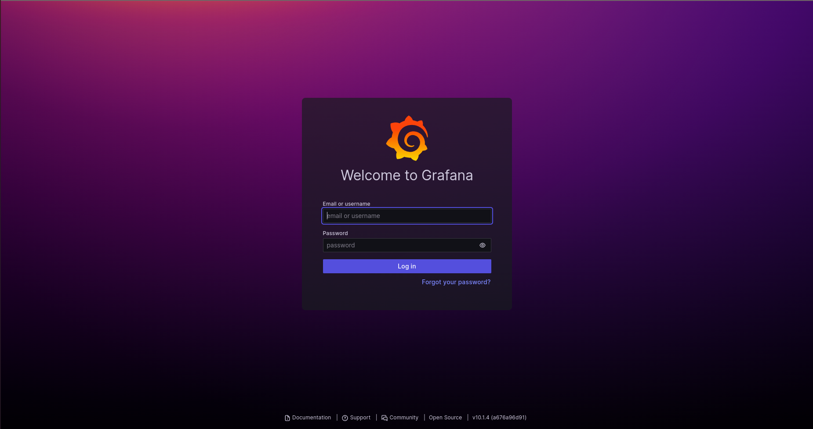

# Smart Farm

## Overview

Smart Farm is an agricultural monitoring system consisting of a web-based dashboard, user authentication, attribute-based access control (ABAC), real-time data visualization, and technical documentation.

## Table of Contents
- [Dependencies and Versions](#dependencies-and-versions)
- [Installation](#installation)
  - [PostgreSQL Database Setup](#postgresql-database-setup)
  - [Client Installation](#client-installation)
  - [Server Installation](#server-installation)
  - [Grafana Installation](#grafana-installation)
- [Folder Structure](#folder-structure)

## Dependencies and Versions

It's important to keep track of the dependencies used in your project. Here's a list of key dependencies and their versions:

| Dependency         | Version     | Description                   |
|--------------------|-------------|-------------------------------|
| React              | 18.2.0      | JavaScript library for UI     |
| React-admin        | 14.5        | Admin UI                      |
| Node.js            | 18.16.0     | JavaScript runtime            |
| npm                | 9.5.1       | Package manager               |
| Sequelize          | 6.33.0      | ORM for database interaction  |
| PostgreSQL         | 14.9        | Relational database system    |
| @nestjs/core       | 12.7        | Node.js framework             |

## Installation

## PostgreSQL Database Setup

Follow these steps to set up your PostgreSQL database for the Smart Farm project:

1. **Log in to your PostgreSQL server:**

    ```bash
    sudo su postgres
    psql
    ```

2. **Create a new user named `farm` with the password '123' and grant them the ability to create databases:**

    ```sql
    CREATE USER farm WITH PASSWORD '123';
    ALTER USER farm CREATEDB;
    ```

3. **Create a new database named `smart_farm`:**

    ```sql
    CREATE DATABASE smart_farm;
    ```

4. **Grant all privileges on the `smart_farm` database to the `farm` user:**

    ```sql
    GRANT ALL PRIVILEGES ON DATABASE smart_farm TO farm;
    ```

5. **Connect to the `smart_farm` database:**

    ```sql
    \c smart_farm
    ```

You have now created a PostgreSQL user named `farm` with the password '123' and granted them the ability to create databases. Additionally, you've created a database named `smart_farm` and granted all privileges on it to the `farm` user.

### Client installation

To install and run the client in development mode:

```bash
cd client/
npm install
npm run start
```

To install and run the client in production mode:
```bash
cd client/
npm install
client-production build
npm run build
serve -s build
server -production
npm start
```
### Server installation

To install and run the server in development mode:

```bash
cd server/
npm install
```

To run the server in production mode:

```bash
cd server/
npm install
npm start
```
Execute the following command to run the migrations
```bash
npx sequelize db:migrate
```
Use the following command to execute all the available seeders:
```bash
npx sequelize db:seed:all
```

### Grafana installation
 ```bash
 sudo apt-get install -y apt-transport-https software-properties-common wget
 sudo mkdir -p /etc/apt/keyrings/
 wget -q -O - https://apt.grafana.com/gpg.key | gpg --dearmor | sudo tee /etc/apt/keyrings/grafana.gpg > /dev/null
 echo "deb [signed-by=/etc/apt/keyrings/grafana.gpg] https://apt.grafana.com stable main" | sudo tee -a /etc/apt/sources.list.d/grafana.list
 sudo apt-get update
 # Installs the latest OSS release:
 sudo apt-get install grafana
 ```

 ```bash
#to run the grafana server automatically when system boots
sudo systemctl enable grafana-server
sudo systemctl start grafana-server
 ```

Modify Grafana Configuration:
Open the /etc/grafana/grafana.ini configuration file.
Find the http_port setting (default is 3000) and change it to run on port 7000.
Locate the allow_embedding setting and change it from false to true.
Ensure that you uncomment these lines if they are originally commented out.
Ensure to do 
```bash
sudo systemctl restart grafana-server
```
These changes will enable Grafana to run on port 7000 and allow for embedding of Grafana dashboards.



 Default password for grafana is "admin" for admin user. It will ask you to change the password for security purposes. The default password for the Grafana admin user is "admin." You will be prompted to change this password for security reasons.
 Before creating a datasource, set up a dedicated user with select privileges in Postgresql:
 ```bash
CREATE USER grafana WITH PASSWORD 'grafana';
GRANT SELECT ON ALL TABLES IN SCHEMA public TO grafana;
 ```

When configuring your datasource, use the following details:

Host: localhost:5432
Database: smart_farm
User: grafana
Password: grafana


Copying Datasource UID:
After configuring your datasource, copy the datasource UID from the window.
Update Configuration Files:
Open the ./grafana/devices.json and ./grafana/fields-greenhouses.json files.
Replace the existing datasource UID in both files with the UID you copied earlier.
Import Dashboards:
In Grafana, navigate to the "Import Dashboard" section.
Upload the devices.json and fields-greenhouses.json files.
Visualize Your Data:
Once imported, you will now have access to the visualizations and dashboards in Grafana, allowing you to explore and analyze your data.
## Folder Structure

### Client

The client folder contains the frontend code for the application.

```bash
.
│
├── src
│   ├── abac.js
│   ├── App.js
│   ├── assets
│   │   ├── static
│   │   │   ├── images and icons...
│   ├── components
│   │   ├── Component files...
│   ├── consts.js
│   ├── index.js
│   ├── layouts
│   │   ├── Layout.js
│   ├── pages
│   │   ├── admin
│   │   │   ├── Admin-related pages...
│   │   ├── auth
│   │   │   ├── Authentication-related pages...
│   │   ├── CommunityManager
│   │   │   ├── Community Manager-related pages...
│   │   ├── MainDashboard.js
│   │   └── owner
│   │       ├── Owner-related pages...
│   ├── providers
│   │   ├── authProvider.js
│   │   ├── authUtils.js
│   │   └── dataProvider.js
│   ├── themes
│   │   ├── general_theme.js
│   │   └── theme.js
│
├── public
│   ├── favicon.ico
│   ├── index.html
│   ├── manifest.json
│   ├── robots.txt
│
├── Dockerfile.local
├── package.json
├── package-lock.json
├── README.md
└── other project files...

```
### Server

The server folder contains the backend code for the application.

```bash
├── config
│   ├── config.js
├── Dockerfile.local
├── nest-cli.json
├── package.json
├── package-lock.json
├── README.md
├── src
│   ├── app
│   │   ├── app.controller.ts
│   │   ├── app.module.ts
│   │   ├── app.service.ts
│   │   ├── auth
│   │   │   ├── auth.controller.ts
│   │   │   ├── auth.module.ts
│   │   │   ├── auth.service.ts
│   │   │   ├── dto
│   │   │   │   └── token-payload.dto.ts
│   │   │   ├── google-auth.service.ts
│   │   │   ├── google.service.ts
│   │   │   ├── guards
│   │   │   │   ├── auth.guard.ts
│   │   │   │   ├── google.oauth.guard.ts
│   │   │   │   ├── roles_perms.decorator.ts
│   │   │   │   └── roles_perms.guard.ts
│   │   │   └── strategies
│   │   │       ├── google.strategy.ts
│   │   │       └── jwt.strategy.ts
│   │   ├── communities
│   │   │   ├── communities.controller.ts
│   │   │   ├── communities.module.ts
│   │   │   └── communities.service.ts
│   │   ├── database
│   │   │   ├── migrations
│   │   │   ├── models
│   │   │   └── seeders
│   │   ├── dto
│   │   │   └── create-device.dto.ts
│   │   ├── main.ts
│   │   ├── measurement-units
│   │   │   ├── measurement-units.controller.ts
│   │   │   ├── measurement-units.module.ts
│   │   │   └── measurement-units.service.ts
│   │   ├── middlewares
│   │   │   └── auth
│   │   │   ├── account.middleware.ts
│   │   │   ├── auth.middleware.ts
│   │   │   └── unauthorized.middleware.ts
│   │   ├── owner-fields
│   │   │   ├── owner-fields.controller.ts
│   │   │   ├── owner-fields.module.ts
│   │   │   └── owner-fields.service.ts
│   │   ├── owner-fixed-devices
│   │   │   ├── owner-fixed-devices.controller.ts
│   │   │   ├── owner-fixed-devices.module.ts
│   │   │   └── owner-fixed-devices.service.ts
│   │   ├── owner-greenhouses
│   │   │   ├── owner-greenhouses.controller.ts
│   │   │   ├── owner-greenhouses.module.ts
│   │   │   └── owner-greenhouses.service.ts
│   │   ├── owner-portable-devices
│   │   │   ├── owner-portable-devices.module.ts
│   │   │   ├── owners-portable-devices.controller.ts
│   │   │   └── owners-portable-devices.service.ts
│   │   ├── owner-products
│   │   │   ├── products.controller.ts
│   │   │   ├── products.module.ts
│   │   │   └── products.service.ts
│   │   └── user
│   │       ├── user-community.service.ts
│   │       ├── user.controller.ts
│   │       ├── user.module.ts
│   │       ├── user-permissions.service.ts
│   │       ├── user-roles.service.ts
│   │       └── user.service.ts
├── test
│   ├── app.e2e-spec.ts
│   └── jest-e2e.json
├── tsconfig.build.json
├── tsconfig.build.tsbuildinfo
└── tsconfig.json

```
